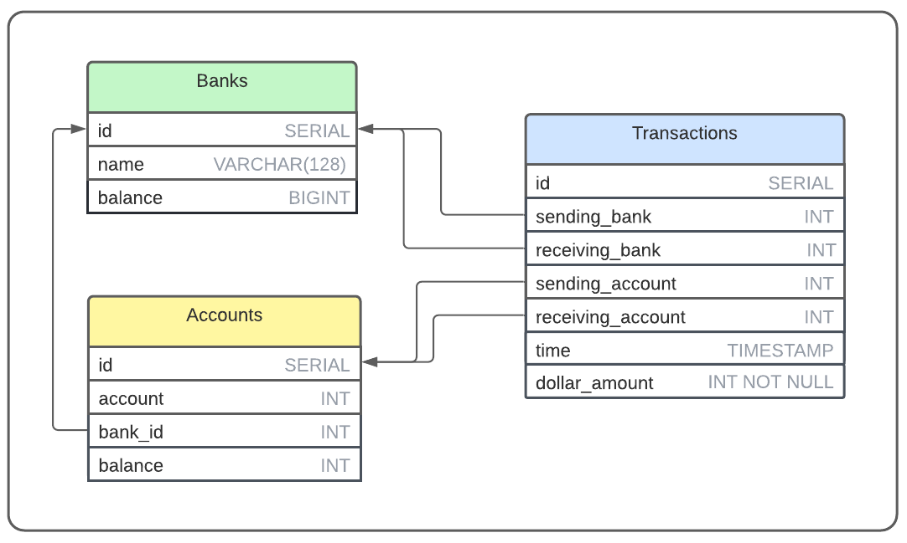

<div align="center">
   
</div>

<p align="center">
  <a href="https://go.dev/doc/go1.17">
    
  </a> 
  <a href="https://www.postgresql.org/docs/12/release-12-9.html">
    
  </a> 
  <a href="https://docs.mongodb.com/manual/release-notes/5.0/">
    
  </a> 
  <a href="https://docs.docker.com/engine/release-notes/">
    
  </a> 
  <a href="./LICENSE">
    
  </a>
</p>

### Intro

Polka Payments is my attempt to build a peer-to-peer payments application, similar to [Zelle](https://www.zellepay.com/). Instead of having an internal ledger like Venmo, Polka wires payments between bank accounts from different banks. Polka benefits consumers with fast and free inter-bank cash transfers, but it also benefits banks, simplifying settlements by acting as a [clearing house](https://en.wikipedia.org/wiki/Clearing_house_(finance)).

## Table of Contents
- [Architecture](#Architecture)
- [Installation](#Installation)
- [Usage](#Usage)
- [License](#License)

## Architecture

<div align="center">
   
</div>

Polka Payments comprises 6 essential components: 
 - A [load balancer](./balancer/) that distributes a high volume of transactions evenly among servers.
 - An [array of servers](./processor/) that handle requests, submitting data to the database and cache.
 - A [cache](./cache) registering changes in account balances efficiently. 
 - A [settler](./settler) that requests a snapshot of all balances from the cache and refers it to both the client and the MongoDB database
 - A PostgreSQL database storing data from each payment and net balances owed to individual banks and accounts.
 - A MongoDB database storing balance snapshots 

<div align="center">
   
</div>

Additionally, since Polka doesn't have any clients (yet!), the project includes a [load generator](https://github.com/sekerez/polka/tree/main/generator) to load test the application. 

## Installation

Polka Payments requires no specific installation, though it does require installing certain Go dependencies. Running a database requires connecting to a [PostgreSQL server](https://www.postgresql.org/) and a [MongoDB server](https://www.mongodb.com/). Running scripts on Linux may require either [tmux](https://github.com/tmux/tmux/wiki) or [multitail](https://www.vanheusden.com/multitail/). Lastly, using docker requires both [Docker](https://docs.docker.com/get-docker/) and [docker-compose](https://docs.docker.com/compose/install/).

### Environmental Variables

Polka Payments' components require environmental variables. These can be set up in the [envs](./envs) directory.

### Databases

Polka Payments requires two databases, one with running PostgreSQL and the other running MongoDB, both configured with a dedicated user. With Docker, setting up your own databases is unnecessary, as Docker automatically runs isolated PostgreSQL and MongoDB containers. Without Docker, the databases must be configured from scratch. For an example of the required login information, check out [envs/postgres.env](envs/postgres.env) and [envs/mongo.env](envs/mongo.env). For the schema, run [setup.sql](./dbinit/setup.sql) to create the required tables in the PostgreSQL database.

### Dependencies

Polka Payments was written on a 64-bit [Ubuntu 20.04 LTS OS](https://releases.ubuntu.com/20.04/) using [Go 1.17](https://go.dev/doc/go1.17). The project uses a few external dependencies, most importantly [pgx](https://github.com/jackc/pgx), a database driver for PostgreSQL.

To download all go dependencies, run from the project's root directory:
```bash
go get 
```

## Usage

Polka payments can run on any operating system supported by Docker or Go and PostgreSQL. It is best run with Docker. Without Docker, it is best run on a Linux distribution that supports Bash. It can nevertheless run on WindowsOS and MacOS without Docker. 

### Running Polka with Docker &#x1F433;

Running Polka is easy with Docker. To start all services, run
```bash
docker-compose up
```

However, this will only run one [processor](./processor/) server. To run multiple, run
```bash
docker-compose up --scale processor=<num>
```
where *num* is the number of processor servers.

To shut down the application, run
```bash
docker-compose down
```

### Running Polka on Linux without Docker &#128039;

To set up all binaries and a given number of processor servers, run
```bash
make prep n=$num
```
where $num is the number of processor servers.

To run the application and view streams of logs in tmux windows and panes, run
```bash
make stmux
```

To run the application and record logs in dedicated log.txt files, run
```bash
make stlog
```
Of note, multitail must be installed in order to view multiple logs at once in the same terminal window.

To shut down the application, run
```bash
make clean
```

### Load testing 

To load test the application, run from the [generator](./generator/) directory
```bash
make spam w=<workers> t=<transactions>
```
where *workers* is the number of maximum ongoing requests in any given moment, and *transactions* is the number of randomly generated transactions (as in payments) that are sent. 

To get a snapshot of all balances stored in the cache, run
```bash
make getsnap
```
To then approve the snapshot and settle all balances, run
```bash
make settle
```

## License
Polka Payments is licensed under the MIT Licence Copyright (c) 2022.

See the [LICENSE](https://github.com/sekerez/polka/blob/main/LICENSE) for information on the history of this software, terms & conditions for usage, and a DISCLAIMER OF ALL WARRANTIES.

All trademarks referenced herein are property of their respective holders.
