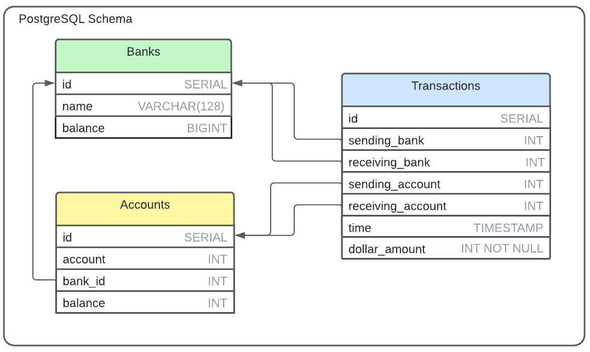

<div align="center">
   
</div>

<p align="center">
  <a href="https://go.dev/doc/go1.17">
    
  </a> 
  <a href="https://www.postgresql.org/docs/12/release-12-9.html">
    
  </a> 
  <a href="https://docs.docker.com/engine/release-notes/">
    
  </a> 
  <a href="./LICENSE">
    
  </a>
</p>

### Intro

Polka Payments is my attempt to build a peer-to-peer payments application, similar to [Zelle](https://www.zellepay.com/). Instead of having an internal ledger like Venmo, Polka wires payments between bank accounts from different banks. Polka benefits consumers with fast and free inter-bank cash transfers, but it also benefits banks, simplifying inter-bank settlements by acting as a [clearing house](https://en.wikipedia.org/wiki/Clearing_house_(finance)) between banks.

## Table of Contents
- [Architecture](#Architecture)
- [Installation](#Installation)
- [Usage](#Usage)
- [License](#License)

## Architecture

<div align="center">
   
</div>

Polka Payments comprises 4 essential components: 
 - A [load balancer](./balancer/) that distributes a high volume of transactions evenly among servers.
 - An [array of servers](./receiver/) that handle requests, submitting data to the database and cache.
 - A [cache](./cache) that acts as a memstore to register changes in account balances efficiently. 
 - A database storing data from each payment and net balances owed to individual banks and accounts.

<div align="center">
   
</div>

Additionally, since Polka doesn't have any users (yet!), the project includes a [load generator](https://github.com/sekerez/polka/tree/main/generator) to load test the application. 

## Installation

Polka Payments requires no specific installation, though it does require installing certain Go dependencies. Running a database requires connecting to a [PostgreSQL server](https://www.postgresql.org/). Running scripts on Linux may require either [tmux](https://github.com/tmux/tmux/wiki) or [multitail](https://www.vanheusden.com/multitail/). Lastly, using docker requires both [Docker](https://docs.docker.com/get-docker/) and [docker-compose](https://docs.docker.com/compose/install/).

### Environmental Variables

Polka Payments' components require environmental variables. These can be set up in the [envs](./envs) directory.

### Database

Polka Payments requires a PostgreSQL database configured with a dedicated user. With Docker, setting up your own database is unnecessary, as Docker automatically runs an isolated PostgreSQL container. Without Docker, the database must be configured from scratch. For an example of the required login information, check out [envs/db.env](https://github.com/sekerez/polka/blob/main/envs/db.env). For the schema, run [setup.sql](./sqlinit/setup.sql) to create the required tables. 

### Dependencies

Polka Payments was written on a 64-bit [Ubuntu 20.04 LTS OS](https://releases.ubuntu.com/20.04/) using [Go 1.17](https://go.dev/doc/go1.17). The project uses a few external dependencies, most importantly [pgx](https://github.com/jackc/pgx), a database driver for PostgreSQL.

To download all go dependencies, run from the project's root directory:
```bash
go get 
```

## Usage

Polka payments can run on any operating system supported by Docker or Go and PostgreSQL. It is best run with Docker. Without Docker, it is best run on a Linux distribution that supports Bash. It can nevertheless run on WindowsOS and MacOS without Docker. 

### Running Polka with Docker &#x1F433;

Running Polka is easy with Docker. To start all services, run
```bash
docker-compose up
```

However, this will only run one [receiver](./receiver/) server. To run multiple, run
```bash
docker-compose up --scale receiver=<num>
```
where *num* is the number of receiver servers.

To shut down the application, run
```bash
docker-compose down
```

### Running Polka on Linux without Docker &#128039;

To set up all binaries and a given number of receiver servers, run
```bash
./scripts/prep.sh <num>
```
where *num* is the number of receiver servers.

To run the application and view streams of logs in tmux windows and panes, run
```bash
./scripts/start_with_tmux.sh
```

To run the application and record logs in dedicated log.txt files, run
```bash
./scripts/start_with_logs.sh
```
Of note, multitail must be installed in order to view multiple logs at once in the same terminal window.

To shut down the application, run
```bash
./scripts/clean_up.sh
```

### Load testing 

To load test the application, run from the [generator](./generator/) directory
```bash
./bin/polkagenerator -w=<workers> -t=<transactions>
```
where *workers* is the number of maximum ongoing requests in any given moment, and *transactions* is the number of randomly generated transactions (as in payments) that are sent. 


## License
Polka Payments is licensed under the MIT Licence Copyright (c) 2022.

See the [LICENSE](https://github.com/sekerez/polka/blob/main/LICENSE) for information on the history of this software, terms & conditions for usage, and a DISCLAIMER OF ALL WARRANTIES.

All trademarks referenced herein are property of their respective holders.
